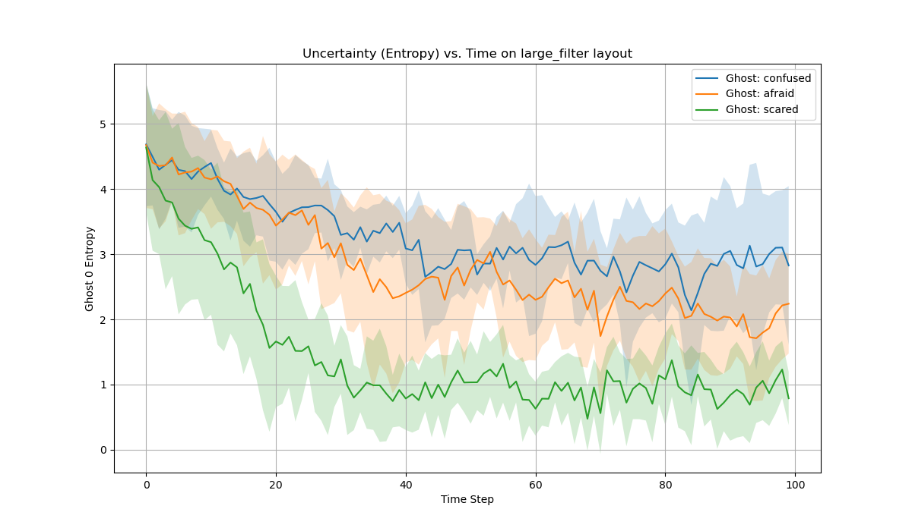
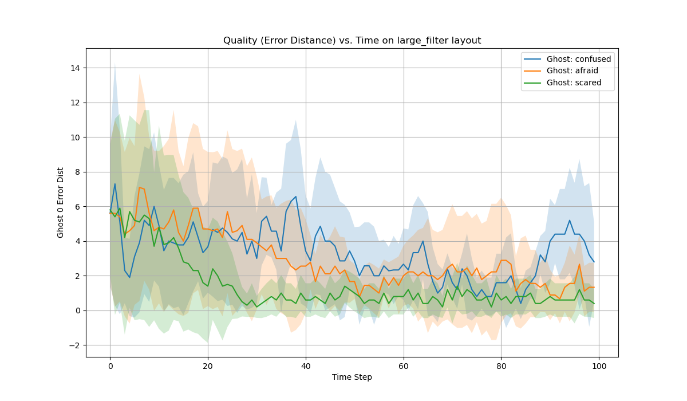
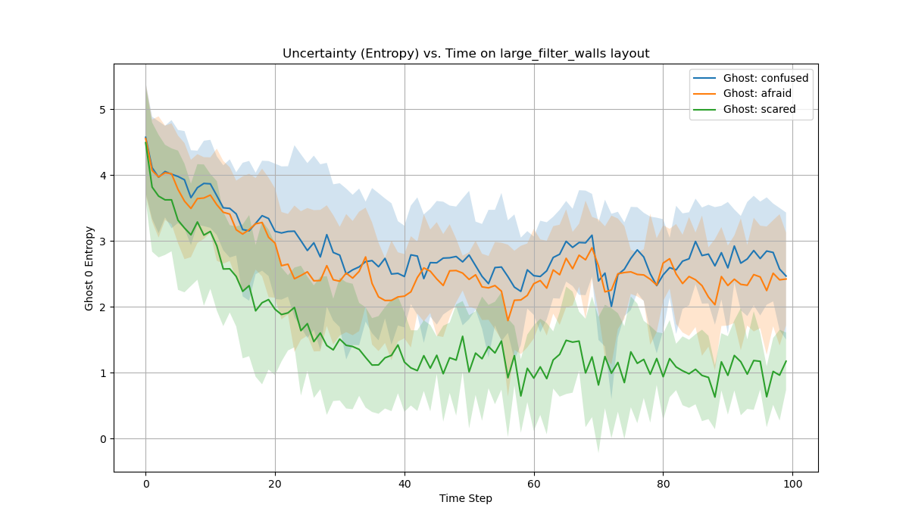
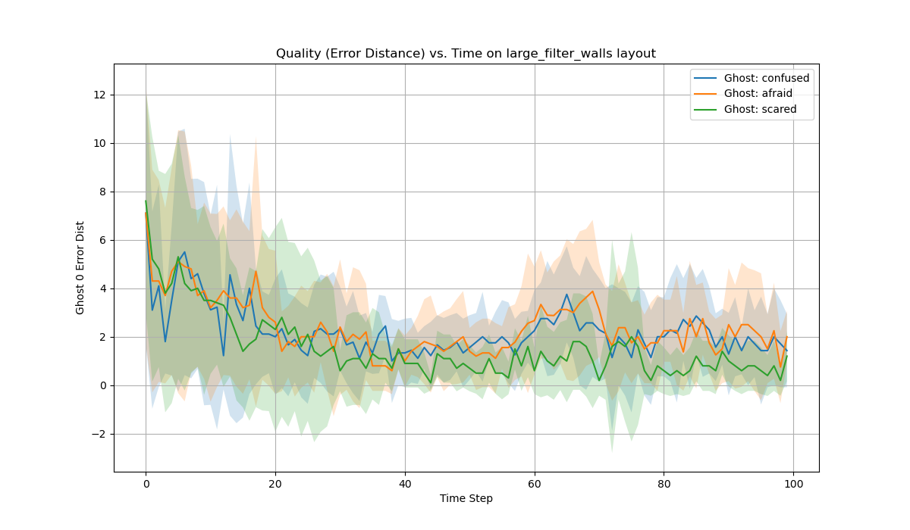

# รายงานโปรเจกต์ 2 (ฉบับแปลภาษาไทย)

---

## 1. Bayes filter

### 1.a.
แบบจำลองเซ็นเซอร์ (Sensor Model) อธิบายถึงความน่าจะเป็นของการสังเกตเห็นหลักฐาน (evidence) $E_t$ (ค่าระยะทางที่วัดได้ซึ่งมี noise) เมื่อกำหนดสถานะที่แท้จริง $X_t$ (ตำแหน่งของผี) มาให้ โดย noise จะถูกจำลองขึ้นโดยใช้การแจกแจงแบบทวินาม (Binomial Distribution) กำหนดให้ $X_t = (w, h)$ คือตำแหน่งของผี และ $X_p$ คือตำแหน่งของ Pac-Man ระยะทางแมนฮัตตันที่แท้จริงคือ $d(X_t, X_p)$ ส่วนหลักฐาน $E_t$ คือระยะทางจริงบวกกับ noise: $E_t = d(X_t, X_p) + \text{noise}$

ตัว noise เองถูกสร้างขึ้นจากตัวแปรสุ่มแบบทวินาม $K \sim \text{Binomial}(n, p)$ โดยที่ noise ถูกนิยามว่า $\text{noise} = K - np$ เมื่อแทนค่านี้ลงในสมการของหลักฐาน เราจะสามารถแก้สมการเพื่อหาค่า $K$ ได้:
$$ K = E_t - d(X_t, X_p) + np $$
ดังนั้น ความน่าจะเป็นที่จะสังเกตเห็นหลักฐาน $E_t$ เมื่อกำหนดสถานะ $X_t$ มาให้ ก็คือฟังก์ชันมวลของความน่าจะเป็น (PMF) ของการแจกแจงแบบทวินามสำหรับค่า $K$ นี้:
$$ P(E_t | X_t) = \text{binom.pmf}(k=E_t - d(X_t, X_p) + np, n, p) $$
โดยที่ $n = \frac{\sigma^2}{p(1-p)}$ ถูกคำนวณมาจากความแปรปรวนของเซ็นเซอร์ (sensor variance) $\sigma^2$ และ $p=0.5$

### 1.b.
แบบจำลองการเคลื่อนที่ที่เป็นหนึ่งเดียว (unified transition model) $P(X_{t+1} | X_t)$ อธิบายการเคลื่อนที่ของผีโดยอิงจากความกลัวที่มีต่อ Pac-Man แบบจำลองนี้มีพารามิเตอร์เพียงตัวเดียวที่เราจะเรียกว่า "แฟกเตอร์ความกลัว" (fear factor) $k_f$ กำหนดให้ $S(X_t)$ คือเซตของตำแหน่งถัดไปที่สามารถเดินไปได้อย่างถูกกฎหมายจากตำแหน่งปัจจุบัน $X_t$ สำหรับตำแหน่งถัดไปใดๆ $X_{t+1} \in S(X_t)$ จะมีการกำหนดค่าน้ำหนัก $w(X_{t+1})$ โดยอิงจากระยะห่างไปยังตำแหน่งของ Pac-Man $X_p$:
$$
w(X_{t+1}) =
\begin{cases}
    k_f & \text{ถ้า } d(X_{t+1}, X_p) \ge d(X_t, X_p) \\
    1 & \text{มิฉะนั้น}
\end{cases}
$$
โดยที่ $d(\cdot, \cdot)$ คือระยะทางแมนฮัตตัน ผีจะชอบเดินไปยังตำแหน่งที่เพิ่มหรือรักษาระยะห่างจาก Pac-Man ซึ่งความชอบนี้จะถูกปรับค่าด้วยแฟกเตอร์ความกลัว $k_f$ ความน่าจะเป็นที่จะเปลี่ยนไปยังตำแหน่งถัดไป $X_{t+1}$ คือค่าน้ำหนักที่ถูกทำให้เป็นบรรทัดฐาน (normalized weight):
$$ P(X_{t+1} | X_t) = \frac{w(X_{t+1})}{\sum_{X'_{t+1} \in S(X_t)} w(X'_{t+1})} $$
แบบจำลองเดียวนี้สามารถแทนพฤติกรรมของผีได้ทั้ง 3 ประเภทโดยการเปลี่ยนค่าพารามิเตอร์ $k_f$:
- **confused**: $k_f = 1$ (เดินเกือบจะสุ่ม เพราะทุกทางที่เดินได้มีน้ำหนักเท่ากัน)
- **afraid**: $k_f = 2$ (มีความชอบเล็กน้อยที่จะเดินหนีจาก Pac-Man)
- **scared**: $k_f = 8$ (มีความชอบอย่างมากที่จะเดินหนีจาก Pac-Man)

---

## 2. การนำไปใช้ (Implementation)

### 2.a.
**\textit{เว้นว่างไว้}**

---

## 3. การทดลอง (Experiment)

### 3.a.
เพื่อสรุปความไม่แน่นอนของสถานะความเชื่อ (Belief State) $B$ ของ Pac-Man เราใช้ค่าเอนโทรปีของแชนนอน (Shannon Entropy) ซึ่งนิยามได้ดังนี้:
$$ H(B) = - \sum_{x} P(x) \log_2 P(x) $$
โดยที่ผลรวมจะถูกคำนวณจากทุกตำแหน่ง $x$ ในเขาวงกต ค่าเอนโทรปีที่สูงบ่งชี้ว่าความน่าจะเป็นกระจายตัวออกไปในหลายตำแหน่ง ซึ่งสอดคล้องกับความไม่แน่นอนที่สูง ในทางกลับกัน ค่าเอนโทรปีที่ต่ำบ่งชี้ว่าความน่าจะเป็นกระจุกตัวอยู่ในพื้นที่เล็กๆ ซึ่งสอดคล้องกับความแน่นอนที่สูง

### 3.b.
เพื่อวัดคุณภาพของสถานะความเชื่อ เราใช้ตัวชี้วัด 2 อย่าง โดยสมมติว่าเราสามารถเข้าถึงตำแหน่งจริงของผี (ground truth) $X_{true}$ ได้:
- **ระยะห่างที่ผิดพลาด (Position Error):** คือระยะทางแมนฮัตตันระหว่างตำแหน่งที่น่าจะเป็นที่สุดในสถานะความเชื่อ (ตำแหน่งที่มีความน่าจะเป็นสูงสุด, $X_{belief}$) กับตำแหน่งจริงของผี
$$ \text{Error} = d(X_{belief}, X_{true}) $$
ค่าที่ต่ำกว่าบ่งชี้ถึงความเชื่อที่แม่นยำกว่า
- **ความน่าจะเป็น ณ ตำแหน่งจริง (Probability at Ground Truth):** คือค่าความน่าจะเป็นที่สถานะความเชื่อกำหนดให้กับตำแหน่งจริงของผี $B(X_{true})$ ค่าที่สูงกว่าบ่งชี้ถึงคุณภาพของความเชื่อที่ดีกว่า เนื่องจากตัวกรองสามารถระบุตำแหน่งที่แท้จริงว่ามีความน่าจะเป็นสูงได้อย่างถูกต้อง

### 3.c.
การทดลองได้ถูกดำเนินการซ้ำ 10 ครั้งสำหรับแต่ละรูปแบบการตั้งค่า โดยรันเป็นเวลา 100 เทิร์น กราฟต่อไปนี้แสดงค่าเฉลี่ยของตัวชี้วัดต่างๆ โดยพื้นที่ที่แรเงาแสดงถึงค่าเบี่ยงเบนมาตรฐานหนึ่งหน่วย

  
  
   
  <b>รูปที่ 1:</b> ความไม่แน่นอน (บน) และคุณภาพ (ล่าง) ในด่าน <code>large_filter</code>

  
  
   
  <b>รูปที่ 2:</b> ความไม่แน่นอน (บน) และคุณภาพ (ล่าง) ในด่าน <code>large_filter_walls</code>

### 3.d.
**อภิปรายผลของแบบจำลองการเคลื่อนที่ของผี:**
พารามิเตอร์ในแบบจำลองการเคลื่อนที่ของผี (ที่เราเรียกว่า "แฟกเตอร์ความกลัว" หรือ $k_f$) เป็นตัวกำหนด "ความสุ่ม" หรือ "ความคาดเดายาก" ในการเดินของผีโดยตรง ซึ่งส่งผลกระทบอย่างมากต่อทั้งพฤติกรรมของผีและความสามารถของ Pac-Man ในการติดตามตำแหน่ง ดังที่เห็นได้ชัดจากกราฟเอนโทรปี (ความไม่แน่นอน) และกราฟระยะห่างที่ผิดพลาด (Error Distance) ของเรา

จากแบบจำลองที่เราสร้างขึ้น ผีอย่าง `scared` (ขี้กลัวมาก, $k_f=8$) มีพฤติกรรมที่ **คาดเดาได้ง่ายมาก** มันจะพยายามเดินหนีออกจาก Pac-Man อย่างสุดความสามารถ พฤติกรรมที่แทบจะตายตัวนี้ทำให้การกระจายตัวของความน่าจะเป็นสำหรับตำแหน่งถัดไปของมันแคบลงมาก ในทางตรงกันข้าม ผี `confused` (สับสน, $k_f=1$) มีแบบจำลองการเคลื่อนที่ที่เกือบจะสม่ำเสมอ (uniform) ทำให้การเดินของมัน **สุ่มและคาดเดายากกว่ามาก** ส่วนผี `afraid` (กลัว, $k_f=2$) ก็มีพฤติกรรมอยู่กึ่งกลางระหว่างสองตัวนี้

ผลลัพธ์จากกราฟของเราสนับสนุนการวิเคราะห์นี้อย่างชัดเจน ในทั้งสองด่าน (`large_filter` และ `large_filter_walls`) เส้นกราฟของผี `scared` (สีน้ำเงิน) ให้ค่าเอนโทรปีและระยะห่างที่ผิดพลาด **ต่ำที่สุดอย่างสม่ำเสมอ** นี่หมายความว่า Pac-Man สามารถรักษาความเชื่อที่ทั้ง "มั่นใจ" และ "แม่นยำ" เกี่ยวกับตำแหน่งของผีได้ดีมาก ตัวกรอง Bayes Filter สามารถคาดเดาการเคลื่อนไหวของผีได้อย่างมีประสิทธิภาพ ทำให้สถานะความเชื่อลู่เข้า (converge) ได้อย่างรวดเร็ว

สำหรับผี `confused` (สีเขียว) ค่าเอนโทรปีและระยะห่างที่ผิดพลาดนั้น **สูงที่สุดตลอดการทดลอง** ความสุ่มในการเคลื่อนที่ของมันหมายความว่าในแต่ละเทิร์น ความน่าจะเป็นของตำแหน่งถัดไปจะกระจายออกไปในพื้นที่ที่กว้างกว่า ทำให้เป็นเรื่องยากสำหรับ Bayes Filter ที่จะลดความไม่แน่นอนลงได้ ส่งผลให้สถานะความเชื่อมีความมั่นใจน้อยและแม่นยำน้อยกว่า

เมื่อเปรียบเทียบระหว่างด่าน เราจะเห็นว่าโดยทั่วไปแล้วทั้งค่าเอนโทรปีและระยะห่างที่ผิดพลาดในด่าน **`large_filter_walls` จะต่ำกว่า** การมีกำแพงมากขึ้นช่วย **จำกัดทางเลือกในการเดิน** ของผีทุกประเภท ซึ่งเป็นการลด "กิ่งก้าน" ของตำแหน่งที่เป็นไปได้ในตาถัดไป ข้อจำกัดนี้ช่วยให้ตัวกรองทำงานได้ง่ายขึ้นโดยการตัดพื้นที่ที่ไม่ต้องพิจารณาออกไป ส่งผลให้สถานะความเชื่อลู่เข้าได้เร็วขึ้นและแม่นยำขึ้นสำหรับผีทุกชนิดเมื่อเทียบกับด่าน `large_filter` ที่เปิดโล่งกว่า

### 3.e.
**อภิปรายผลของความแปรปรวนของเซ็นเซอร์:**
ความแปรปรวนของเซ็นเซอร์เป็นพารามิเตอร์ที่สำคัญอย่างยิ่งในแบบจำลองเซ็นเซอร์ มันเป็นตัวกำหนด "ความน่าเชื่อถือ" ของข้อมูลที่ Pac-Man วัดได้ หรือพูดอีกอย่างคือเป็นตัววัด "ความรวน" (noise) ของเซ็นเซอร์ ค่าความแปรปรวนต่ำหมายถึงเซ็นเซอร์ที่เชื่อถือได้ ในขณะที่ค่าความแปรปรวนสูงหมายถึงเซ็นเซอร์ที่รวนและเชื่อถือได้น้อย

**กรณีความแปรปรวนต่ำ (Low Variance):** จะทำให้การกระจายตัวของความน่าจะเป็นจากแบบจำลองเซ็นเซอร์ (likelihood) มีลักษณะเป็น "ยอดแหลม" สูงรอบๆ ระยะทางที่วัดได้ เมื่อนำข้อมูลนี้ไปใช้ใน Bayes Filter มันจะส่งผล "แก้ไข" สถานะความเชื่อได้อย่างรุนแรง ตัวกรองจะให้น้ำหนักกับข้อมูลจากเซ็นเซอร์อย่างมาก ทำให้สถานะความเชื่อที่อัปเดตแล้วลู่เข้าสู่พื้นที่เล็กๆ ที่มีความมั่นใจสูงได้อย่างรวดเร็วมาก ผลลัพธ์คือค่าเอนโทรปีจะลดลงอย่างรวดเร็ว และระยะห่างที่ผิดพลาดก็จะต่ำ (ถ้าเซ็นเซอร์แม่นยำ)

**กรณีความแปรปรวนสูง (High Variance):** จะทำให้การกระจายตัวของความน่าจะเป็น (likelihood) มีลักษณะ "แบนและกว้าง" ซึ่งหมายความว่ามีตำแหน่งของผีที่เป็นไปได้มากมายที่สามารถอธิบายค่าที่เซ็นเซอร์วัดมาได้ เมื่อนำข้อมูลที่ไม่แน่นอนนี้ไปคูณกับความเชื่อก่อนหน้า มันจะส่งผล "แก้ไข" สถานะความเชื่อได้เพียงเล็กน้อย ขั้นตอนการอัปเดตความเชื่อจะมีประสิทธิภาพในการลดความไม่แน่นอนน้อยลง ทำให้ค่าเอนโทรปีลดลงช้ากว่ามาก ด้วยเหตุนี้ สถานะความเชื่อของ Pac-Man จะยังคงกระจายตัวเป็นวงกว้างไปอีกนาน และระยะห่างที่ผิดพลาดก็มีแนวโน้มที่จะสูงขึ้น เพราะตัวกรองไม่สามารถระบุตำแหน่งของผีได้อย่างมั่นใจ

โดยสรุป การเพิ่มความแปรปรวนของเซ็นเซอร์จะทำให้ประสิทธิภาพของตัวกรองลดลง ทำให้ Pac-Man "ไม่มั่นใจ" มากขึ้น (เอนโทรปีสูงขึ้น) และ "แม่นยำน้อยลง" (ระยะห่างที่ผิดพลาดสูงขึ้น) เกี่ยวกับตำแหน่งของผีเมื่อเวลาผ่านไป

### 3.f.
**แนวทางการสร้าง Pac-Man อัตโนมัติเพื่อกินผี:**
เพื่อสร้างตัวควบคุม Pac-Man ที่ไล่ล่าผีอย่างจริงจัง เราสามารถออกแบบนโยบายที่เลือกการกระทำเพื่อ "ลดระยะห่างไปยังตำแหน่งที่น่าจะเป็นที่สุดของผี" ในขณะเดียวกันก็พยายาม "ปรับปรุงสถานะความเชื่อของตัวเอง" ไปด้วย แนวทางหนึ่งที่เป็นไปได้คือการสร้างเอเจนต์สไตล์ **Expectimax**

เอเจนต์จะประเมินการกระทำที่ทำได้ตามกฎหมายแต่ละอย่างจากสถานะปัจจุบันของมัน สำหรับแต่ละการกระทำ มันจะคาดการณ์ผลที่จะตามมาโดยพิจารณาจาก:
1.  **ตำแหน่งที่น่าจะเป็นที่สุดของผี (Most Likely Ghost Position):** เป้าหมายหลักคือการกินผี เอเจนต์สามารถระบุช่อง $(x, y)$ ที่มีความน่าจะเป็นสูงสุดในสถานะความเชื่อปัจจุบัน $B(X_t)$ แล้วเลือกการกระทำที่ลดระยะห่าง Manhattan Distance ไปยังช่องนั้นให้เหลือน้อยที่สุด
2.  **ความไม่แน่นอนในอนาคต (Future Uncertainty):** เอเจนต์ที่ซับซ้อนขึ้นจะพิจารณาด้วยว่าการกระทำนั้นจะช่วยปรับปรุงสถานะความเชื่อในอนาคตได้อย่างไร หลังจากเดินไปยังตำแหน่งใหม่ Pac-Man จะได้รับข้อมูลจากเซ็นเซอร์ใหม่ เอเจนต์สามารถเลือกการกระทำที่นำไปสู่ตำแหน่งที่ "ค่าคาดหวังของเอนโทรปีในอนาคต" จะต่ำที่สุด ตัวอย่างเช่น การเดินไปยังตำแหน่งที่อยู่ตรงกลางของพื้นที่ที่มีความน่าจะเป็นสูง อาจทำให้ได้รับข้อมูลจากเซ็นเซอร์ในเทิร์นถัดไปที่มีประโยชน์มากกว่า
3.  **คุณค่าของการกินผี (Value of Eating):** ฟังก์ชันประเมินค่าสถานะ (evaluation function) จะให้รางวัลที่สูงมากสำหรับสถานะที่ตำแหน่งของ Pac-Man ตรงกับตำแหน่งที่น่าจะเป็นที่สุดของผี (เช่น เมื่อกินผีได้) และให้การลงโทษเล็กน้อยในแต่ละเทิร์นเพื่อกระตุ้นให้เกมจบเร็ว (มีประสิทธิภาพ)

จากนั้น ตัวควบคุมจะเลือกการกระทำที่ให้ "ค่าคาดหวังอรรถประโยชน์" (Expected Utility) สูงสุด โดยสร้างสมดุลระหว่างเป้าหมายระยะสั้น (การเข้าใกล้ผี) กับเป้าหมายระยะยาว (การรักษาสถานะความเชื่อที่มั่นใจ)

### 3.g.
**\textit{เว้นว่างไว้}**